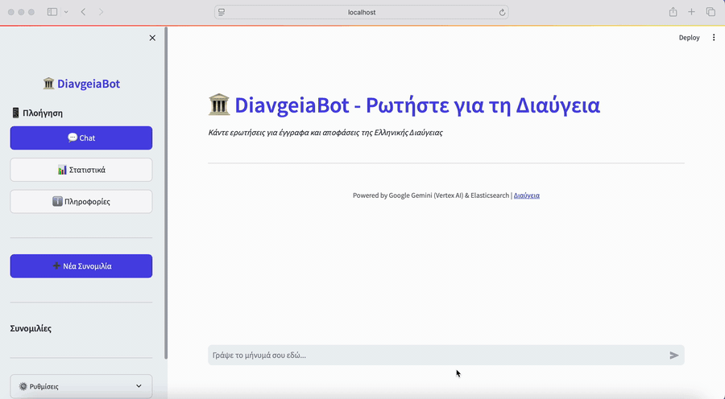

# Diavgeia Chat-Based Assistant

A Greek-language RAG assistant for **Διαύγεια** (Diavgeia) government documents.
Ask natural-language questions; the assistant retrieves relevant decisions from
Elasticsearch and answers with **Google Gemini (Vertex AI)**, citing the ΑΔΑ
number of each document it used.

This repo is the cleaned starting point for an **EELLAK-supported** extension of
the original prototype. The underlying corpus, extraction pipeline, boilerplate
analysis, and RAG benchmark are described in our paper — see [Research](#research).

## Demo

**🔗 Live demo:** http://35.224.220.36:8501 — *DiavgeiaAssistant*, a hosted
instance answering natural-language questions over ~32K sampled Diavgeia
decisions (BM25 retrieval + **Gemini 2.5 Flash** via Vertex AI), with multi-turn
chat and ΑΔΑ citations.



*The recording above shows the previous interface.*

> **Note:** the interface has been redesigned — a new chat layout with
> right-aligned user messages and a navigation sidebar. The **live demo above
> already runs this updated UI**; the refreshed Streamlit code and an updated demo
> recording will be added to this repo shortly. The live demo is a community
> deployment and may not always be online.

---

## Repo layout

```
.
├── streamlit_ui/
│   ├── streamlit_app_v2.py       Streamlit chat UI — current interface (entry point)
│   ├── streamlit_app_demo.py     Earlier UI (kept for reference)
│   └── assets/                   Bot/user avatars
│
├── diaygeia/                     Assistant Python package
│   ├── bot/response.py           DiaygeiaBot — retrieval + Gemini generation
│   ├── domain.py                 Conversation dataclass / DataFrame wrapper
│   ├── session/manage_session.py Redis-backed per-user chat history
│   ├── data_io/redis/engine.py   Redis connection factory
│   └── txt_to_index.py           Bulk-index .txt files into Elasticsearch
│
├── Diaygeia.ipynb                Data-processing notebook
├── Dockerfile                    Image used by docker-compose
├── docker-compose.yml            redis + elasticsearch + kibana + streamlit
├── requirements.txt              Python deps
└── .gitignore
```

A `secrets/gcp-sa.json` file (gitignored) must hold your GCP service-account
key — `docker-compose.yml` mounts it read-only into the container.

---

## How it works

1. User asks a question in the Streamlit UI.
2. `DiaygeiaBot.get_context` runs a BM25 query against the `diaygeia` index in
   Elasticsearch and pulls the top-k matching decision texts.
3. Recent conversation history is fetched from Redis (compressed JSON keyed by
   `session_id`).
4. The retrieved context, history, and user question are sent to
   **Gemini (Vertex AI)**, which produces an answer that includes the ΑΔΑ of
   each document it relied on.
5. The new turn is appended to Redis history.

---

## Running

### 1. Drop your GCP service-account JSON into `secrets/`

```bash
mkdir -p secrets
cp /path/to/your-service-account.json secrets/gcp-sa.json
```

`docker-compose.yml` mounts this at `/app/secrets/gcp-sa.json` inside the
container. The GCP project ID and Gemini model are already set in the compose
file — edit them there if you need different values.

### 2. Build and start the stack

```bash
docker compose up --build
```

This brings up Redis, Elasticsearch, Kibana, and the Streamlit UI.
UI → http://localhost:8501.

### 3. Index your Diavgeia text files

The bot has nothing to retrieve until you populate Elasticsearch. Mount a
folder of `.txt` decisions into the running container and run the indexer:

```bash
docker compose exec streamlit python diaygeia/txt_to_index.py
```

(Adjust the hardcoded `path` at the top of `diaygeia/txt_to_index.py` first, or
edit it to read from an env var.)

---

## Data-processing notebook

`Diaygeia.ipynb` contains exploration and preprocessing for Diavgeia data.
Open it locally with Jupyter, or run a one-off Jupyter container against the
project deps.

---

## Research

This assistant accompanies our dataset-and-RAG paper, which introduces a
**1-million-document** open corpus of Greek government decisions (normalized
metadata + Markdown text), a reproducible extraction pipeline with a comparative
OCR/VLM benchmark, a Greek **boilerplate-extraction** method, and the
evidence-grounded **RAG task** this assistant implements.

> G. Antoniou, G. Filandrianos, A. Vlachos, G. Stamou, L. Kollimenos,
> K. Skianis, M. Vazirgiannis.
> *A Greek Government Decisions Dataset for Public-Sector Analysis and Insight.*
> arXiv:2512.05647, 2025. — https://arxiv.org/abs/2512.05647

```bibtex
@article{antoniou2025diavgeia,
  title   = {A Greek Government Decisions Dataset for Public-Sector Analysis and Insight},
  author  = {Antoniou, Giorgos and Filandrianos, Giorgos and Vlachos, Aggelos and Stamou, Giorgos and Kollimenos, Lampros and Skianis, Konstantinos and Vazirgiannis, Michalis},
  journal = {arXiv preprint arXiv:2512.05647},
  year    = {2025}
}
```

---

## Acknowledgements

- [Διαύγεια / Diavgeia](https://diavgeia.gov.gr) — built and operated by **OTS (Open Technology Services)**
- [Google Gemini](https://ai.google.dev/) · [Vertex AI](https://cloud.google.com/vertex-ai)
- [Elasticsearch](https://www.elastic.co) · [Streamlit](https://streamlit.io)
- [EELLAK](https://eellak.gr) 
